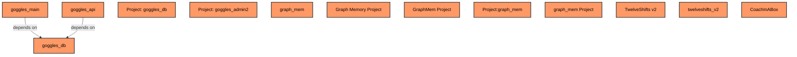
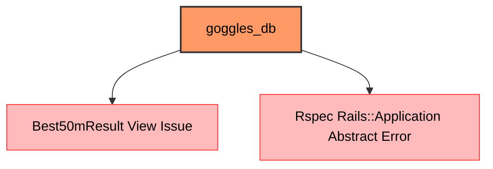
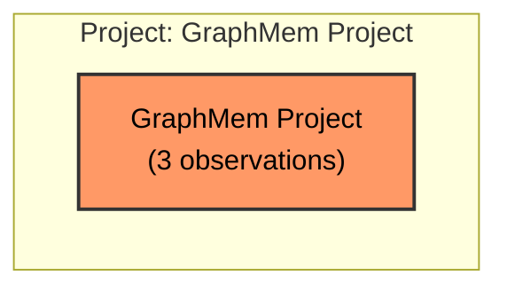
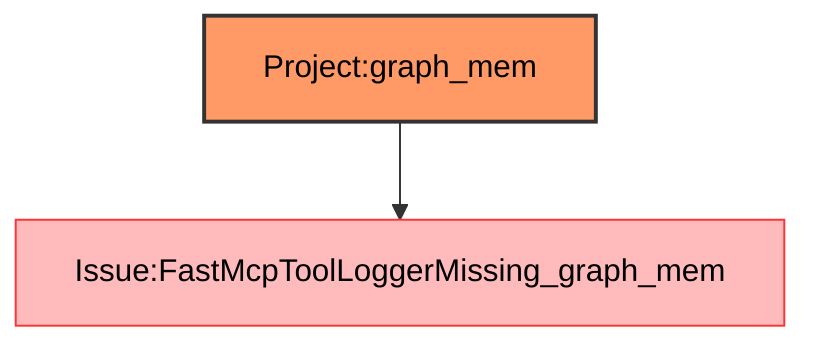
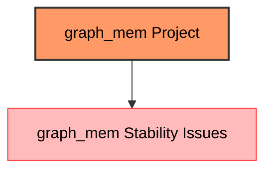
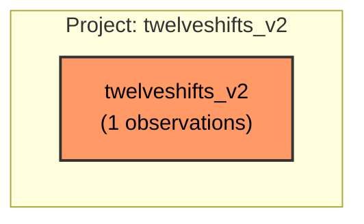
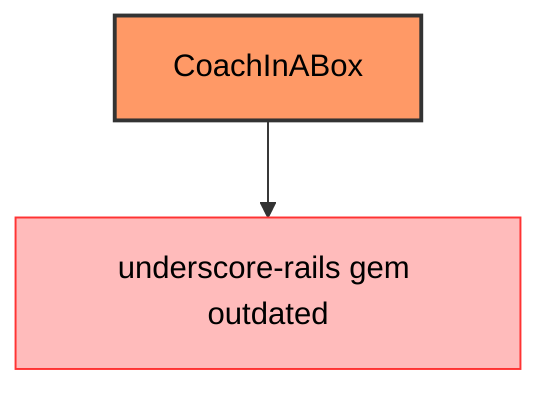

```mermaid
graph TD
  P356["TwelveShifts v2"]:::project
  I397["RSpec Cucumber Integration Issue"]:::issue
  P356 --> I397
  I400["Cucumber Terminal Disconnect Issue"]:::issue
  P356 --> I400
  I402["Production Docker Build Issue"]:::issue
  P356 --> I402
  I405["TSv2 Production Login Issue"]:::issue
  P356 --> I405
  I409["Docker DB Init Path Issue"]:::issue
  P356 --> I409
  I411["init_db.sh Heredoc Issue"]:::issue
  P356 --> I411
  I412["PostgreSQL Database Connection Issue"]:::issue
  P356 --> I412
  I413["Docker Production Authentication Issue"]:::issue
  P356 --> I413
  I414["Syslogger Production Logging Issue"]:::issue
  P356 --> I414
  I416["CSRF Token Authentication Issue"]:::issue
  P356 --> I416
  classDef project fill:#f96,stroke:#333,stroke-width:2px,color:#000
  classDef issue fill:#fbb,stroke:#f33,stroke-width:1px,color:#000
```

# Project Knowledge Graph Overview

Generated on: 2025-06-10T10:56:08Z


---


## All Projects Interconnectivity




---


## Project: goggles_db

*ID: 210*

### Relationships Overview

```mermaid
graph TD
  subgraph "Project: goggles_db"
    direction LR
    P210["goggles_db<br/>(5 observations)"]:::project
  end
  T_Project_210[
  P210 -- "2 relations" --> T_Project_210
  T_DatabaseEntity_210[
  P210 -- "4 relations" --> T_DatabaseEntity_210
  T_Task_210[
  P210 -- "3 relations" --> T_Task_210
  T_Issue_210[
  P210 -- "2 relations" --> T_Issue_210
  classDef project fill:#f96,stroke:#333,stroke-width:2px,color:#000
  classDef entityType fill:#bbf,stroke:#33f,stroke-width:1px,color:#000
```

### Associated Issues



### Recent Observations

- `2025-05-20`: Planning to refactor 'best result' view models (Best50mResult, Best50And100Result, BestSwimmer5yResult, BestSwimmerAllTimeResult) using a common Ab...
- `2025-05-20`: Serves as a dependency for goggles_main, goggles_api, and goggles_admin2
- `2025-05-20`: Core database component for the Goggles framework
- `2025-05-20`: Rails Engine gem implementing the database structure
- `2025-05-20`: Located at /home/steve/Projects/goggles_db


---


## Project: goggles_main

*ID: 211*

### Relationships Overview

```mermaid
graph TD
  subgraph "Project: goggles_main"
    direction LR
    P211["goggles_main<br/>(3 observations)"]:::project
  end
  T_Project_211[
  P211 -- "1 relations" --> T_Project_211
  classDef project fill:#f96,stroke:#333,stroke-width:2px,color:#000
  classDef entityType fill:#bbf,stroke:#33f,stroke-width:1px,color:#000
```

### Recent Observations

- `2025-05-20`: Depends on goggles_db for database structure
- `2025-05-20`: Read-only interface for viewing swimming competition results
- `2025-05-20`: Front-end client application


---


## Project: goggles_api

*ID: 212*

### Relationships Overview

```mermaid
graph TD
  subgraph "Project: goggles_api"
    direction LR
    P212["goggles_api<br/>(4 observations)"]:::project
  end
  T_Project_212[
  P212 -- "1 relations" --> T_Project_212
  classDef project fill:#f96,stroke:#333,stroke-width:2px,color:#000
  classDef entityType fill:#bbf,stroke:#33f,stroke-width:1px,color:#000
```

### Recent Observations

- `2025-05-20`: Depends on goggles_db for database structure
- `2025-05-20`: Facilitates data synchronization between main UI and admin interface
- `2025-05-20`: Provides read-write access to the database
- `2025-05-20`: API backend for the Goggles framework


---


## Project: Project: goggles_db

*ID: 233*

### Relationships Overview

```mermaid
graph TD
  subgraph "Project: Project: goggles_db"
    direction LR
    P233["Project: goggles_db<br/>(2 observations)"]:::project
  end
  T_PossibleSolution_233[
  P233 -- "1 relations" --> T_PossibleSolution_233
  T_Framework_233[
  P233 -- "2 relations" --> T_Framework_233
  classDef project fill:#f96,stroke:#333,stroke-width:2px,color:#000
  classDef entityType fill:#bbf,stroke:#33f,stroke-width:1px,color:#000
```

### Recent Observations

- `2025-05-20`: Rails Engine gem containing database models for Goggles framework.
- `2025-05-20`: Path: /home/steve/Projects/goggles_db


---


## Project: Project: goggles_admin2

*ID: 234*

### Relationships Overview

```mermaid
graph TD
  subgraph "Project: Project: goggles_admin2"
    direction LR
    P234["Project: goggles_admin2<br/>(2 observations)"]:::project
  end
  T_Task_234[
  P234 -- "1 relations" --> T_Task_234
  T_Framework_234[
  P234 -- "1 relations" --> T_Framework_234
  classDef project fill:#f96,stroke:#333,stroke-width:2px,color:#000
  classDef entityType fill:#bbf,stroke:#33f,stroke-width:1px,color:#000
```

### Recent Observations

- `2025-05-20`: Admin interface for Goggles framework, uses goggles_db gem.
- `2025-05-20`: Path: /home/steve/Projects/goggles_admin2


---


## Project: graph_mem

*ID: 283*

### Relationships Overview

```mermaid
graph TD
  subgraph "Project: graph_mem"
    direction LR
    P283["graph_mem<br/>(12 observations)"]:::project
  end
  T_Task_283[
  P283 -- "3 relations" --> T_Task_283
  T_Framework_283[
  P283 -- "3 relations" --> T_Framework_283
  classDef project fill:#f96,stroke:#333,stroke-width:2px,color:#000
  classDef entityType fill:#bbf,stroke:#33f,stroke-width:1px,color:#000
```

### Recent Observations

- `2025-06-09`: The key insight: parameter name 'content' was clashing with FastMCP's internal response format. Renaming this parameter prevents collision with MCP...
- `2025-06-09`: After upgrading to FastMCP 1.5.0, the project no longer requires a monkey patch for FastMcp::Server#handle_tools_call that was previously needed in...
- `2025-06-09`: After upgrading to FastMCP 1.5.0, the project no longer requires a monkey patch for FastMcp::Server#handle_tools_call that was previously needed in...
- `2025-06-09`: After upgrading to FastMCP 1.5.0, the project no longer requires a monkey patch for FastMcp::Server#handle_tools_call that was previously needed in...
- `2025-06-09`: After upgrading to FastMCP 1.5.0, the project no longer requires a monkey patch for FastMcp::Server#handle_tools_call that was previously needed in...


---


## Project: Graph Memory Project

*ID: 300*

### Relationships Overview

```mermaid
graph TD
  subgraph "Project: Graph Memory Project"
    direction LR
    P300["Graph Memory Project<br/>(3 observations)"]:::project
  end
  T_Task_300[
  P300 -- "1 relations" --> T_Task_300
  classDef project fill:#f96,stroke:#333,stroke-width:2px,color:#000
  classDef entityType fill:#bbf,stroke:#33f,stroke-width:1px,color:#000
```

### Recent Observations

- `2025-05-20`: Local main branch successfully pushed to remote origin/main and is tracking the remote.
- `2025-05-20`: Remote Git repository: git@github.com:steveoro/graph_mem.git
- `2025-05-20`: Project path: /home/steve/Projects/graph_mem


---


## Project: GraphMem Project

*ID: 317*

### Relationships Overview



### Recent Observations

- `2025-05-20`: The project aims to implement an MCP server with SSE support using `fast-mcp`.
- `2025-05-20`: The project is a Rails application.
- `2025-05-20`: The main application module is `GraphMem` as defined in `config/application.rb`.


---


## Project: Project:graph_mem

*ID: 323*

### Relationships Overview

```mermaid
graph TD
  subgraph "Project: Project:graph_mem"
    direction LR
    P323["Project:graph_mem<br/>(2 observations)"]:::project
  end
  T_Framework_323[
  P323 -- "1 relations" --> T_Framework_323
  T_ApplicationStack_323[
  P323 -- "1 relations" --> T_ApplicationStack_323
  T_Issue_323[
  P323 -- "1 relations" --> T_Issue_323
  classDef project fill:#f96,stroke:#333,stroke-width:2px,color:#000
  classDef entityType fill:#bbf,stroke:#33f,stroke-width:1px,color:#000
```

### Associated Issues



### Recent Observations

- `2025-05-20`: Primary objective: Integrate fast-mcp gem for MCP communication.
- `2025-05-20`: Path: /home/steve/Projects/graph_mem


---


## Project: graph_mem Project

*ID: 338*

### Relationships Overview

```mermaid
graph TD
  subgraph "Project: graph_mem Project"
    direction LR
    P338["graph_mem Project<br/>(12 observations)"]:::project
  end
  T_SoftwareLibrary_338[
  P338 -- "1 relations" --> T_SoftwareLibrary_338
  T_Issue_338[
  P338 -- "1 relations" --> T_Issue_338
  T_File_338[
  P338 -- "2 relations" --> T_File_338
  classDef project fill:#f96,stroke:#333,stroke-width:2px,color:#000
  classDef entityType fill:#bbf,stroke:#33f,stroke-width:1px,color:#000
```

### Associated Issues



### Recent Observations

- `2025-06-10`: Located in workspace: /home/steve/Projects/graph_mem
- `2025-06-10`: Based on the FastMcp Rails gem.
- `2025-06-10`: Supports stdio and SSE protocols (stdio better tested).
- `2025-06-10`: Has an internal API for potential direct MCP resource mapping.
- `2025-06-10`: Uses a database backend (PostgreSQL implied, similar to other user projects).


---


## Project: TwelveShifts v2

*ID: 356*

### Relationships Overview

```mermaid
graph TD
  subgraph "Project: TwelveShifts v2"
    direction LR
    P356["TwelveShifts v2<br/>(11 observations)"]:::project
  end
  T_Configuration_356[
  P356 -- "3 relations" --> T_Configuration_356
  T_TestFramework_356[
  P356 -- "1 relations" --> T_TestFramework_356
  T_UtilityScripts_356[
  P356 -- "1 relations" --> T_UtilityScripts_356
  T_Documentation_356[
  P356 -- "2 relations" --> T_Documentation_356
  T_TaskList_356[
  P356 -- "1 relations" --> T_TaskList_356
  T_ConfigIssue_356[
  P356 -- "1 relations" --> T_ConfigIssue_356
  T_Framework_356[
  P356 -- "2 relations" --> T_Framework_356
  T_BestPractice_356[
  P356 -- "1 relations" --> T_BestPractice_356
  T_DatabaseSchema_356[
  P356 -- "1 relations" --> T_DatabaseSchema_356
  T_ApplicationPurpose_356[
  P356 -- "1 relations" --> T_ApplicationPurpose_356
  T_ApplicationArchitecture_356[
  P356 -- "1 relations" --> T_ApplicationArchitecture_356
  T_Database_356[
  P356 -- "1 relations" --> T_Database_356
  T_SecurityComponent_356[
  P356 -- "1 relations" --> T_SecurityComponent_356
  T_DependencyList_356[
  P356 -- "1 relations" --> T_DependencyList_356
  T_Issue_356[
  P356 -- "12 relations" --> T_Issue_356
  T_Task_356[
  P356 -- "1 relations" --> T_Task_356
  T_PossibleSolution_356[
  P356 -- "6 relations" --> T_PossibleSolution_356
  T_Feature_356[
  P356 -- "1 relations" --> T_Feature_356
  classDef project fill:#f96,stroke:#333,stroke-width:2px,color:#000
  classDef entityType fill:#bbf,stroke:#33f,stroke-width:1px,color:#000
```

### Associated Issues



### Recent Observations

- `2025-06-10`: Has PDF generation capabilities with Prawn and wicked_pdf
- `2025-06-10`: Uses Delayed Job for background processing
- `2025-06-10`: Implements Devise for authentication
- `2025-06-10`: Uses PostgreSQL for database
- `2025-06-10`: Uses Rails 5.2.8.1 (not 6.2 as previously noted)


---


## Project: twelveshifts_v2

*ID: 446*

### Relationships Overview



### Recent Observations

- `2025-06-10`: Folder path: /home/steve/Projects/twelveshifts_v2


---


## Project: CoachInABox

*ID: 455*

### Relationships Overview

```mermaid
graph TD
  subgraph "Project: CoachInABox"
    direction LR
    P455["CoachInABox<br/>(2 observations)"]:::project
  end
  T_Issue_455[
  P455 -- "1 relations" --> T_Issue_455
  T_Task_455[
  P455 -- "1 relations" --> T_Task_455
  classDef project fill:#f96,stroke:#333,stroke-width:2px,color:#000
  classDef entityType fill:#bbf,stroke:#33f,stroke-width:1px,color:#000
```

### Associated Issues



### Recent Observations

- `2025-06-10`: Framework: Ruby on Rails 5.1.7
- `2025-06-10`: Project folder: coach_in_a_box


---
